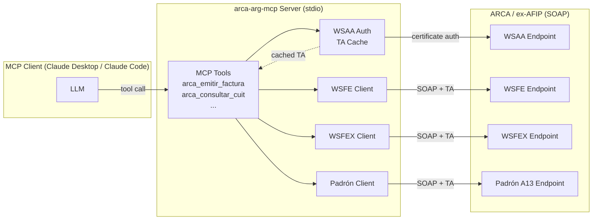

# arca-arg-mcp

[](https://github.com/jnvallejos/arca-arg-mcp/actions/workflows/ci.yml)

Servidor MCP (Model Context Protocol) para cumplimiento fiscal en Argentina. Expone los web services de ARCA (ex-AFIP) como herramientas que podés usar desde Claude Desktop, Claude Code o cualquier cliente compatible con MCP.

## Qué hace

- Autentica contra ARCA vía WSAA (con certificado X.509)
- Valida CUITs contra el Padrón A13
- Emite facturas electrónicas (Factura A, B, C) por WSFE
- Emite facturas de exportación (Factura E) por WSFEX

## Estado

- [x] Fase 0 — Setup del proyecto y scaffolding MCP
- [x] Fase 1 — Autenticación WSAA
- [x] Fase 2 — Padrón (consulta de CUIT)
- [x] Fase 3 — WSFE (Factura A, B, C)
- [x] Fase 4 — WSFEX (Factura E)
- [ ] Fase 5 — Release v1.0.0

## Por qué existe

Los web services de ARCA son SOAP, raros y están mal documentados — cualquier
desarrollador argentino que alguna vez tuvo que facturar desde código redescubrió
los mismos casos límite a los golpes. Este proyecto los envuelve como herramientas
MCP para que un LLM (o cualquier cliente MCP) pueda manejarlos con una interfaz
limpia y tipada, en lugar de que cada equipo reescriba la misma capa de auth y
firma desde cero.

## Arquitectura

Tres capas: el cliente MCP le habla a este servidor por stdio; el servidor mantiene
un ticket emitido por WSAA y lo usa para manejar los cuatro web services SOAP de
ARCA.



La flecha punteada de WSAA hacia Tools representa el ticket cacheado
(`ta-<cuit>-<service>.json`) reutilizado en llamadas posteriores dentro de su
ventana de ~12 horas de validez.

## Requisitos previos

- **Node.js 20** o superior
- **`openssl`** disponible en tu `PATH` (ya viene instalado en macOS y la mayoría
  de las distros Linux; en Windows lo conseguís con Git Bash, WSL o un paquete
  nativo como los binarios Win32 de OpenSSL)
- Una **Clave Fiscal de AFIP / ARCA** válida — la misma con la que entrás al
  portal de ARCA como contribuyente

## Quick start

Si ya tenés un CUIT y un certificado emitido por ARCA:

```bash
git clone https://github.com/jnvallejos/arca-arg-mcp.git
cd arca-arg-mcp
npm install
npm run build
# Después de completar la sección "Obtener credenciales de prueba en ARCA" más abajo:
ARCA_ENV=homologation \
ARCA_CUIT=<tu-cuit> \
ARCA_CERT_PATH=<ruta-al-cert.pem> \
ARCA_KEY_PATH=<ruta-a-la-private.key> \
npm run smoke
```

Si `npm run smoke` imprime `Smoke test PASSED`, estás listo para conectarlo a un
cliente. Mirá la sección **Usar con Claude Desktop** más abajo.

## Obtener credenciales de prueba en ARCA

Para autenticarte contra ARCA vas a necesitar un certificado X.509 que la propia
ARCA emite a tu CUIT. Los pasos de abajo recorren el entorno de homologación
(testing) de punta a punta. Producción sigue la misma forma pero usa otros
portales de ARCA; no toques producción hasta que homologación te funcione.

El portal de autogestión de certificados se llama **WSASS** (*Web Services
Autogestión de Certificados*). Todos los textos de la UI de ARCA están en
castellano; URLs y nombres de botones aparecen abajo verbatim.

### 1. Generar una clave privada RSA

En un directorio bajo tu control (sugerencia: `~/.arca/homo/`):

```bash
mkdir -p ~/.arca/homo && cd ~/.arca/homo
openssl genrsa -out private.key 2048
chmod 600 private.key
```

La clave es tuya; no la subas, no la commitees, no la compartas.

### 2. Generar un Certificate Signing Request (CSR)

```bash
openssl req -new -key private.key \
  -subj "/C=AR/O=Tu Nombre/CN=arca-arg-mcp/serialNumber=CUIT XXXXXXXXXXX" \
  -out request.csr
```

Reemplazá:

- `Tu Nombre` por tu nombre legal completo (o la razón social, si usás un CUIT
  de empresa)
- `XXXXXXXXXXX` por tu CUIT de 11 dígitos, sin guiones ni espacios
- El `CN` (`arca-arg-mcp`) es solo un alias y puede ser cualquier valor
  alfanumérico

El formato `serialNumber=CUIT XXXXXXXXXXX` con un espacio literal entre `CUIT` y
los dígitos es **obligatorio para ARCA**. No le cambies el formato.

### 3. Adherir el servicio WSASS

WSASS es opt-in. Lo habilitás una sola vez por Clave Fiscal.

1. Abrí <https://www.arca.gob.ar>
2. Hacé clic en **"Acceso con Clave Fiscal"** y entrá con tu Clave Fiscal
3. En la lista de servicios, clic en **"ARCA"**, después **"Servicios
   Interactivos"**, después **"WSASS — Autogestión Certificados Homologación"**
4. Si el servicio no aparece: abrí **"Administrador de Relaciones de Clave
   Fiscal"** (también desde la lista de servicios principal), clic en
   **ADHERIR SERVICIO**, clic en el botón **ARCA**, después **Servicios
   Interactivos**, buscá **"WSASS — Autogestión Certificados Homologación"** y
   confirmá la autorización
5. Cerrá sesión y volvé a entrar — el servicio aparece en el menú recién después
   de re-autenticarte

### 4. Crear un DN y enviar el CSR

Dentro de WSASS:

1. Hacé clic en **Nuevo Certificado**
2. **Nombre simbólico del DN:** cualquier alias alfanumérico (sin guiones, sin
   espacios). Sugerencia: `arcaargmcphomo`
3. **CUIT del contribuyente:** ya viene precargado con tu CUIT
4. **Solicitud de certificado en formato PKCS#10:** pegá el contenido entero de
   `request.csr` (incluyendo las líneas `-----BEGIN CERTIFICATE REQUEST-----` y
   `-----END CERTIFICATE REQUEST-----`)
5. Hacé clic en **Crear DN y obtener certificado**

ARCA te devuelve un certificado X.509 en formato PEM dentro del cuadro
**Resultado**. Copiá el bloque entero, incluyendo las líneas
`-----BEGIN CERTIFICATE-----` / `-----END CERTIFICATE-----`.

### 5. Guardar el certificado

```bash
cd ~/.arca/homo
# Pegá el contenido en cert.pem con tu editor preferido, o con un heredoc:
cat > cert.pem << 'EOF'
-----BEGIN CERTIFICATE-----
... pegar acá ...
-----END CERTIFICATE-----
EOF
chmod 644 cert.pem
```

### 6. Autorizar el certificado para un web service

WSASS distingue entre **tener un certificado** y **autorizarlo para hablar con
un web service específico**. Tenés que hacer las dos cosas.

Dentro de WSASS:

1. Hacé clic en **Crear autorización a servicio**
2. **Nombre simbólico del DN a autorizar:** elegí el alias que creaste en el
   paso 4
3. **CUIT representado:** tu propio CUIT
4. **Servicio al que desea acceder:** para el smoke test, elegí
   **`wsfe — Factura electrónica`**
5. Hacé clic en **Crear autorización de acceso**

Tenés que ver *"OK. Autorización fue creada (...)"*. El certificado queda
autorizado para autenticarse contra WSAA para el servicio `wsfe` en
homologación.

## Configuración

El servidor lee estas variables de entorno al arrancar:

| Variable          | Obligatoria | Ejemplo                          | Notas                                                              |
| ----------------- | ----------- | -------------------------------- | ------------------------------------------------------------------ |
| `ARCA_ENV`        | Sí          | `homologation` o `production`    | Elige el endpoint de WSAA. Sin default; tenés que pasarla explícita |
| `ARCA_CUIT`       | Sí          | `20111111112`                    | CUIT de 11 dígitos, sin guiones ni espacios                         |
| `ARCA_CERT_PATH`  | Sí          | `~/.arca/homo/cert.pem`          | Absoluta, relativa o con `~`; se resuelve al arrancar               |
| `ARCA_KEY_PATH`   | Sí          | `~/.arca/homo/private.key`       | Mismas reglas que `ARCA_CERT_PATH`                                  |
| `ARCA_CACHE_DIR`  | No          | `~/.arca-arg-mcp/cache`          | Dónde se guardan los TA cacheados (default mostrado)                |

El cert y la key tienen que existir y ser legibles al arrancar. El CUIT se
valida solo por formato (11 dígitos numéricos). El dígito verificador del CUIT
no se valida acá; eso lo confirma la propia ARCA cuando la primera llamada de
autenticación funciona.

## Correr los smoke tests

Hay cuatro smoke scripts, que se pueden correr individualmente o encadenados:

- `npm run smoke:wsaa` — ejercita el flujo WSAA completo contra homologación de
  ARCA: arma el TRA, firma con PKCS#7 / CMS, llama `loginCms`, parsea el TA y
  lo escribe en disco.
- `npm run smoke:padron` — busca un CUIT en el web service Padrón A13,
  reutilizando el token de WSAA. Requiere que el certificado esté autorizado
  para `ws_sr_padron_a13` (mirá el paso 6 de **Obtener credenciales de prueba
  en ARCA** y elegí ese servicio al autorizar).
- `npm run smoke:wsfe` — emite una **Factura B** real en el entorno de
  homologación contra Consumidor Final (`tipoDocReceptor=99`,
  `numeroDocReceptor='0'`, `importeTotal=$121,00`) e imprime el largo del CAE
  devuelto (el CAE en sí nunca se muestra). El certificado tiene que estar
  autorizado para `wsfe`. Opcionalmente podés setear `SMOKE_PV` para
  sobrescribir el punto de venta por defecto `1`. Las facturas de homologación
  no tienen validez fiscal, no aparecen en el padrón productivo y no afectan
  declaraciones.
- `npm run smoke:wsfex` — emite una **Factura E** real (factura de exportación)
  en el entorno de homologación contra un cliente extranjero ficticio
  (`TEST CLIENT INC`, ESTADOS UNIDOS, USD 100,
  `idImpositivoExterior=TEST-EIN-12345`) usando la cotización que ARCA publica
  para el día. Imprime solo el largo del CAE devuelto (el CAE en sí nunca se
  muestra). El certificado tiene que estar autorizado para `wsfex`.
  Opcionalmente podés setear `SMOKE_PV` para sobrescribir el punto de venta por
  defecto `1`. Mismas garantías de homologación que `smoke:wsfe`.
- `npm run smoke` — corre `smoke:wsaa`, después `smoke:padron`, después
  `smoke:wsfe`, después `smoke:wsfex` en secuencia (corta al primer error).
  Útil para una verificación punta a punta después del setup.

```bash
ARCA_ENV=homologation \
ARCA_CUIT=20111111112 \
ARCA_CERT_PATH=~/.arca/homo/cert.pem \
ARCA_KEY_PATH=~/.arca/homo/private.key \
npm run smoke
```

El smoke de WSAA escribe un TA en `~/.arca-arg-mcp/cache/ta-<cuit>-wsfe.json`
la primera vez. Las corridas siguientes dentro de ~12 horas reutilizan la
caché y terminan en milisegundos. Para forzar una autenticación nueva, borrá
el archivo de caché.

Por defecto `smoke:padron` busca tu propio CUIT (cualquier CUIT puede buscarse
a sí mismo). Para buscar otro CUIT, seteá `SMOKE_CUIT`:

```bash
SMOKE_CUIT=30711111119 npm run smoke:padron
```

Los smoke scripts redactan datos sensibles: `smoke:wsaa` imprime solo el largo
del token / sign; `smoke:padron` imprime solo largos de campos y conteos —
nunca nombres, direcciones ni descripciones de actividad; `smoke:wsfe` y
`smoke:wsfex` imprimen solo el largo del CAE, no el CAE en sí.

### Errores comunes

- `ConfigError: ARCA_CERT_PATH: file at ... does not exist or is not readable.`
  Corregí la ruta. La expansión de tilde (`~`) solo funciona para `~/...`, no
  para `~usuario/...`.
- `WsaaError: coe.invalidSignature: ...` — el cert y la key no coinciden, o
  enviaste un CSR generado a partir de otra key. Regenerá la key + CSR + cert.
- `WsaaError: <unauthorized service>` — el cert es válido pero no está
  autorizado para el servicio que estás llamando (`ws_sr_padron_a13` para
  `smoke:padron`, `wsfe` para `smoke:wsfe`, `wsfex` para `smoke:wsfex`).
  Repetí el paso 6 de **Obtener credenciales de prueba en ARCA**, eligiendo el
  servicio que necesitás.
- `PadronError: NOT_FOUND: ...` — el CUIT no existe en los registros de ARCA.
  Verificá `SMOKE_CUIT` (o tu propio `ARCA_CUIT`).

## Usar con Claude Desktop

Agregá el servidor al config MCP de Claude Desktop
(`~/Library/Application Support/Claude/claude_desktop_config.json` en macOS;
ruta equivalente en Linux/Windows):

```json
{
  "mcpServers": {
    "arca-arg-mcp": {
      "command": "node",
      "args": ["/ruta/absoluta/a/arca-arg-mcp/dist/index.js"],
      "env": {
        "ARCA_ENV": "homologation",
        "ARCA_CUIT": "20111111112",
        "ARCA_CERT_PATH": "/ruta/absoluta/a/cert.pem",
        "ARCA_KEY_PATH": "/ruta/absoluta/a/private.key"
      }
    }
  }
}
```

Reiniciá Claude Desktop. Las herramientas disponibles van a aparecer en el
selector del chat.

### Herramientas disponibles

- **`ping`** — health check; devuelve `pong`.
- **`arca_status`** — reporta la configuración actual de ARCA y el estado del
  token cacheado, sin exponer el token en sí.
- **`arca_consultar_cuit`** — busca un CUIT en el web service Padrón A13 de
  ARCA y devuelve sus datos fiscales (razón social / nombre, estado,
  actividades, domicilio, condición tributaria). Útil para validar un CUIT
  antes de facturarle.
- **`arca_emitir_factura`** — emite una Factura A (1), B (6) o C (11) por
  WSFE y devuelve el CAE. Si omitís `numeroComprobante`, el servidor pide el
  último autorizado y usa el siguiente. Soporta concepto Productos, Servicios
  o ambos. Solo pesos argentinos en V1 (moneda extranjera va por WSFEX en
  Fase 4). Notas de Crédito y Notas de Débito no están expuestas en V1.
  Requiere `condicionIvaReceptor` (RG 5616) — el código de condición frente al
  IVA del receptor: `1`=Responsable Inscripto, `4`=Sujeto Exento,
  `5`=Consumidor Final, `6`=Monotributo, `7`=No Categorizado,
  `8`=Proveedor del Exterior, `9`=Cliente del Exterior,
  `10`=IVA Liberado Ley 19.640, `13`=Monotributista Social,
  `15`=IVA No Alcanzado, `16`=Monotributista Trabajador Independiente Promovido.
- **`arca_obtener_ultimo_comprobante`** — devuelve el último número de
  comprobante autorizado para un punto de venta y tipo dados (1 / 6 / 11).
  Útil para saber cuál es el próximo número antes de emitir.
- **`arca_consultar_comprobante`** — recupera el detalle completo de un
  comprobante autorizado previamente (fecha, importes, CAE, vencimiento) por
  punto de venta, tipo y número. Devuelve un mensaje amigable de "no se
  encontró" cuando ARCA no tiene registro del comprobante.
- **`arca_listar_tipos_comprobante`** — lista los tipos de comprobante que
  soporta este servidor (Factura A, B, C). Ayuda al LLM a elegir el
  `tipoComprobante` correcto antes de llamar `arca_emitir_factura`.
- **`arca_emitir_factura_exportacion`** — emite una Factura E (factura de
  exportación, tipo 19) por WSFEX y devuelve el CAE. Pensada para freelancers
  y empresas argentinas que facturan a clientes del exterior en moneda
  extranjera. Soporta ~12 monedas (USD, EUR, GBP, BRL, CLP, UYU, JPY, CNY,
  KRW, CHF, MXN, CAD) y los 12 destinos más comunes. La cotización tiene que
  pasarse explícitamente — llamá `arca_obtener_cotizacion_moneda` primero
  para obtener el valor que ARCA va a aceptar. Si omitís `numeroComprobante`,
  el servidor pide el último autorizado y usa el siguiente. PERMISO_EMBARQUE,
  comprobantes asociados y opcionales quedan para V2.
- **`arca_obtener_ultimo_comprobante_exportacion`** — devuelve el último
  número de Factura E autorizado para un punto de venta dado. Útil para saber
  cuál es el próximo número antes de emitir.
- **`arca_consultar_factura_exportacion`** — recupera el detalle completo de
  una Factura E autorizada previamente (cliente, importes, moneda,
  cotización, CAE, vencimiento) por punto de venta y número. Devuelve un
  mensaje amigable de "no se encontró" cuando ARCA no tiene registro.
- **`arca_obtener_cotizacion_moneda`** — devuelve la cotización (ARS por
  unidad de moneda extranjera) que ARCA publica para el día. Llamala antes de
  `arca_emitir_factura_exportacion` para pasar el valor exacto que ARCA
  espera.

## Desarrollo

Requiere Node.js 20+.

```bash
npm install            # instalar dependencias
npm test               # correr toda la suite de Vitest
npm run lint           # lint de Biome (política de cero warnings)
npm run typecheck      # chequeo estricto de TypeScript
npm run build          # compilar a dist/
npm run smoke          # verificación punta a punta WSAA + Padrón + WSFE + WSFEX (necesita credenciales reales)
npm run smoke:wsaa     # solo el smoke de WSAA
npm run smoke:padron   # solo el smoke de Padrón (seteá SMOKE_CUIT para buscar un CUIT específico)
npm run smoke:wsfe     # solo el smoke de WSFE — emite una Factura B real en homologación (seteá SMOKE_PV para sobrescribir el punto de venta)
npm run smoke:wsfex    # solo el smoke de WSFEX — emite una Factura E real (USD 100) contra un cliente extranjero ficticio en homologación
```

Los scripts `npm run smoke*` **no** están conectados a CI — necesitan un
certificado real emitido por ARCA. CI corre solo tests unitarios e de
integración.

## Estructura del proyecto

```
arca-arg-mcp/
├── docs/             specs de implementación fase por fase
├── scripts/          scripts solo para desarrollo (smoke-wsaa.ts, smoke-padron.ts, smoke-wsfe.ts, smoke-wsfex.ts)
├── src/
│   ├── config/       carga de env y tabla de endpoints de ARCA
│   ├── lib/          utilidades compartidas (logging, paths, errores)
│   ├── padron/       cliente SOAP, parser y formatter de Padrón A13
│   ├── tools/        handlers de las herramientas MCP (ping, arca_status, arca_consultar_cuit, arca_emitir_factura, arca_emitir_factura_exportacion, ...)
│   ├── wsaa/         auth WSAA: armado del TRA, firma CMS, cliente SOAP, caché del TA
│   ├── wsfe/         WSFE Factura A/B/C: códigos, builder, parser, formatter, cliente SOAP
│   └── wsfex/        WSFEX Factura E (exportación): códigos, builder, parser, formatter, cliente SOAP
└── tests/            tests unitarios e de integración con Vitest, espejo de src/
```

## Licencia

MIT — ver [LICENSE](LICENSE).
